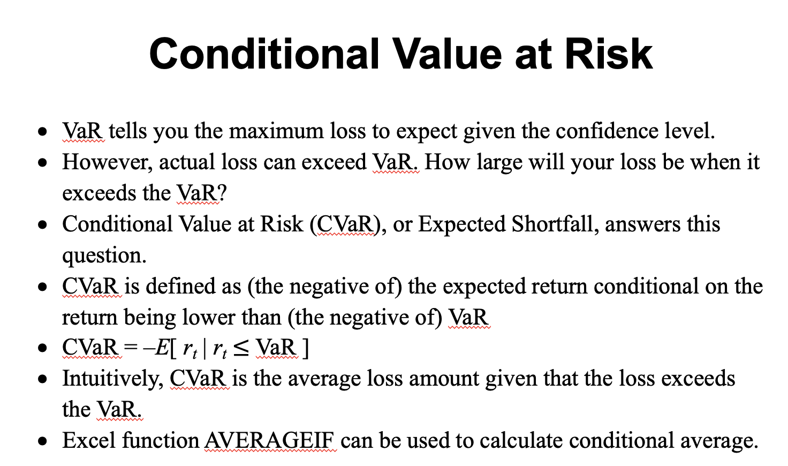

# Financial Modelling

This repo is my study notes of module Financial Modelling at University of Exeter.

This module covers a range of topics in finance drawn from investment analysis, corporate finance, fixed income analysis, risk management and international finance.

The emphasis of the module is on the practical application of finance theory, with lectures on each topic followed by in-depth practical exercises in which you will work through real world problems using Microsoft Excel. The module will also introduce you to the use of Visual Basic for Applications (VBA) in financial modelling.

Week 1: Introduction to financial modelling

Week 2: Portfolio optimisation

Week 3: Portfolio management

Week 4: Risk measurement

Week 5: Volatility forecasting

Week 6: Reading week (no teaching activities)

Week 7: Yield curve modelling

**Reading Material**

* Financial Modeling (4th edition) by Simon Benninga, MIT Press, 2014 (ebook available from library)
* Introductory Econometrics for Finance (2nd edition) by Chris Brooks, Cambridge University Press, 2008 (ebook available from library)

Financial Data

Portfolio Optimization

Portfolio Management

Conditional Value at Risk

Modelling Bond Yield Curve

